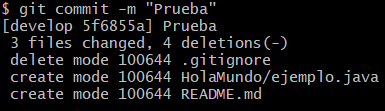
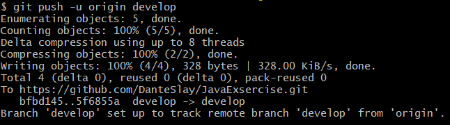

# P04 - GitHub (remoto) a local
__Javier Arreaza__
___
### TRABAJAR CON FICHEROS MARKDOWN
Vamos a crear un __repositorio público__, con una __descripción__, un fichero __README.md__, un fichero __.gitignore__(modelo por defecto para ficheros *Java*) y __licencia MIT__ dentro de nuestro perfil de __GitHub__.

Para ___clonarlo y tener una copia del repositorio en local___, seguimos estos pasos:
1. En GitHub.com, navegue a la página principal del repositorio.
2. Encima de la lista de archivos, haga clic en __<> CODE__.

    

3. Copia la dirección ___URL___ del repositorio.
    - Para clonar el repositorio con HTTPS, en «HTTPS» haz clic en 📋. 
    - Para clonar el repositorio mediante una clave SSH, incluido un certificado emitido por la entidad de certificación SSH de la organización, haga clic en Usar SSH y luego en 📋.
    - Para clonar un repositorio mediante GitHub CLI, haz clic en GitHub CLI y, después, haz clic en 📋.

        
    

4. Abra ___Git Bash___ desde la carpeta 📁 donde quieras clonar el directorio.

5. Escriba `git clone` y pegue la _dirección URL_ que ha copiado antes.
~~~
$ git clone https://github.com/YOUR-USERNAME/YOUR-REPOSITORY
~~~

Con esto ya tendremos __copiado__ el repositorio en _local_.

___
### <u>BIFURCAR UN REPOSITORIO</u>
#### Qué ocurre si modificamos un repositorio clonado❔❔❔
Para ello vamos a ___bifurcar___ un repositorio __random__ de __GitHub__ que contenga ejercicios de _programación en Java_ 🍵.

En GitHub se bifurca desde la pagina de un repositorio, pinchando en el botón ___Frok___ de la esquina superior derecha.

Ya nos dicen en este punto que una ___bifurcación no afecta al repositorio original___:

~~~
A fork is a copy of a repository. Forking a repository allows you to freely experiment with changes without affecting the original project.
~~~

Por lo que __confirmamos sin miedo__ 😎.

Ahora veremos que una ___copia___ de ese directorio aparece en nuestros __repositorios__.

Seguimos los pasos _anteriores_ para __clonar__ el repositorio en local.

Ahora para __probar__ que sucede si trabajamos sobre este proyecto vamos a __eliminar__ 💣 y __editar__ 📝 algun _archivo_.
- _Creamos una carpeta_ __README.md__ con el comando `git touch README.md`. 
- ___Eliminamos___ el archivo __.gitignore__ con `git rm .gitignore`.
- _Creamos_ la carpeta __HolaMundo__ con `mkdir HolaMundo` entramos en ella con `cd HolaMundo` y _creamos_ un archivo ___Java___ con `touch ejemplo.java`.

    

Confirmamos el proyecto y los subimos a __GitHub__:
1. Abrimos ___Git Bash___ y comprobamos el estado del _repositorio_ con:
    - `git status`.

        

    - Si lo queremos ver en un estilo ___simplificado___ podemos usar `git status -s`.

        

2. ___Añadimos___ los cambios a la __zona de preparación__ con `git add "FILE"` añadiendo los cambios uno a uno o podemos usar `git add .` para añadir todos a la vez (__Cuidado por si nos cuela un cambio del que no nos acordamos__).

3. ___Comprobamos___ una vez más con `git status -s` y nos dice que _todos los cambios estan listos para hacer commit_.

    

4. Hacemos ___commit___ con `git commit -m "text"`.

    

5. ___Conectamos___ el repositorio con __GitHub__ `git push -u origin branch` que en mi caso es ___develop___.

    

Ahora vamos a ir a _nuestro repositorio_ a ver qué ha sucedido 😜.

__Todos los cambios__ aparecen tal cual los hemos editado, pero... ___Que ha sucedido con el repositorio original___ ❔❔

Como vemos y se nos prometio anteriormente, el repositorio original está ___INTACTO___ 😈.

---

### <u>TERCERA PARTE: CÓMO HACER LO MISMO EN GIT BASH (con comandos) Y EN IntelliJ IDEA</u>

Para cada uno de los __comandos__ que hemos visto en _local_, hay una correspondencia (___más fácil___) en los menús de __IntelliJ IDEA__. Así, de paso, repasamos los comandos y lo que hace cada uno. 

<table>
    <tr>
        <th>
            <strong>Git Bash (comandos)</strong>
        </th>
        <th>
            <strong>IntelliJ IDEA</strong>
        </th>
    </tr>
    <tr>
        <td colspan="2">
            Crear un repositorio local
        </td>
    </tr>
    <tr>
        <td>
            <code>git init</code>
        </td>
        <td>
            <code>New > File > Project...</code>
        </td>
    </tr>
    <tr>
        <td colspan="2">
            Comprobar el estado de un repositorio
        </td>
    </tr>
    <tr>
        <td>
            <code>git status</code>
        </td>
        <td>
            <code>Click derecho > Local History > Show History </code>
              
            
        </td>
    </tr>
    <tr>
        <td colspan="2">
            Añadir ficheros al área de preparación
        </td>
    </tr>
   <tr>
        <td>
            <code>git add FILE</code>
        </td>
        <td>
            <code>Ctrl + Alt + A</code>
              
            
        </td>
    </tr>
    <tr>
        <td colspan="2">
            Confirmar cambios
        </td>
    </tr>
    <tr>
        <td>
            <code>git commit</code>
        </td>
        <td>
            <code>Click derecho > Git > Commit File</code>
              
            
        </td>
    </tr>
    <tr>
        <td colspan="2">
            Mostrar el registro de cambios realizados
        </td>
    </tr>
    <tr>
        <td>
            <code>git log</code>
        </td>
        <td>
            <code>Alt + 9</code>
              
            
        </td>
    </tr>
    <tr>
        <td colspan="2">
            Ver qué repositorios remotos tenemos conectados a nuestro repositorio local
        </td>
    </tr>
    <tr>
        <td>
            <code>git remote</code>
        </td>
        <td>
            <code>Click derecho > Git > Manage Remotes...</code>
              
            
        </td>
    </tr>
    <tr>
        <td colspan="2">
            Subir cambios realizados y confirmados al repositorio remoto
        </td>
    </tr>
    <tr>
        <td>
            <code>git push -u BRANCH</code>
        </td>
        <td>
            <code>Click derecho > Git > Push...</code>
              
            
        </td>
    </tr>
    <tr>
        <td colspan="2">
            Clonar un repositorio remoto a mi equipo local
        </td>
    </tr>
    <tr>
        <td>
            <code>git clone URL</code>
        </td>
        <td>
            <code>Click derecho > Git > Clone... Introducimos la URL del repositorio</code>
              
            
        </td>
    </tr>
</table>

